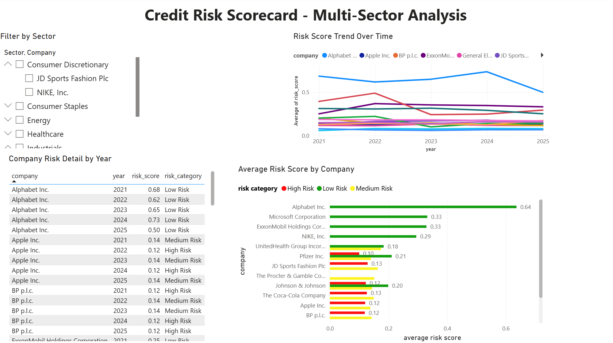

# **Credit Risk Scorecard – Multi-Sector Analysis**

# **Overview**

This project builds a simple credit risk scoring model from 15 publicly listed companies across 6 sectors using financial data pulled from public company filings. It combines Excel, SQL, Python, and Power BI into an end-to-end workflow, from raw data collection, through ratio calculation and risk scoring, to an interactive dashboard

The project was built as a portfolio piece to apply accounting and financial knowledge (credit risk and ratio analysis) alongside practical data skills across multiple tools.

# **Data Source**

All financial data was sourced from [capitaliq.com](http://capitaliq.com), using provided financial data for fiscal years 2021-2025

## Companies covered, by sector:

|Sector|Companies|
|-|-|
|Technology|Apple, Alphabet, Microsoft|
|Healthcare|Johnson \& Johnson, UnitedHealth Group, Pfizer|
|Industrials|Boeing, General Electric|
|Energy|BP, ExxonMobil|
|Consumer Staples|Coca-Cola, Procter \& Gamble, Tesco|
|Consumer Discretionary|JD Sports Fashion, Nike|

# 

# **Tools \& Workflow**

* **Excel:** collated and organised raw financial data (where available) into a single master table
* **SQL:** imported the master data table into a MySQL database. Wrote a view to calculate risk ratios: Debt-to-Equity, Current Ratio, and Altman Z-score
* **Python:** pulled the calculated ratios from SQL, normalised them, and built a weighted risk-scoring model. Companies are ranked into low, medium, and high risk categories, and a year-on-year trend is calculated per company to show whether risk is improving or worsening over time
* **Power BI:** built an interactive dashboard, with sector and company filtering, a risk trend line over time, a company table, and a colour-coded comparison risk-category chart

# **Methodology**

## Three ratios were chosen to reflect different angles of credit risk:

* **Debt-to-Equity:** evaluates a company’s financial leverage. Higher values (around or above 1) indicates that a company relies more heavily on debt relative to shareholder equity, increasing financial risk
* **Current Ratio:** measures a company’s ability to pay its obligations that are due within a year, AKA its short-term liquidity
* **Altman Z-score:** a combined formula which measures a company’s financial health and aims to estimate a company’s likelihood of bankruptcy by blending liquidity, profitability, leverage, solvency, and asset efficiency into a single bankruptcy-risk indicator

Each ratio was normalized to a 0–1 scale and combined into a single weighted risk score. Companies were then split into High/Medium/Low risk categories. Risk categories are relative to this specific group of 15 companies rather than an absolute external benchmark

**Note on Data Gaps:** Not all companies report figures in the same way. Apple, for example, doesn’t report interest expense as its own separate line. As Apple aggregates its interest expense  with a broader “non-operating” figure,a clean figure was not available. Because of this, interest coverage ratio (a ratio which shows how easily a company can cover the interest on its debt) could not be calculated for all companies, and therefore was not used as a main part of every company’s risk score. Similarly, current assets and current liabilities were not available for UnitedHealth Group, so its current ratio could not be calculated, and its score was based on the remaining ratios instead.

# **Dashboard**

****

## The dashboard allows the data to be filtered by sector and company. It includes:

* A trend line of risk scores over time, split by company
* A detailed table of company, year, risk score, and risk category
* A bar chart comparing average risk scores across companies, colour-coded by risk category

# **Limitations \& Future Improvements**

* **Sample Size:** 15 companies is a small sample. A larger dataset would provide more statistically meaningful risk groupings
* **Data Gaps:** inconsistent data reporting across companies meant some ratios couldn't be calculated for every company
* **Future Improvements:** a historical window extending beyond 5 years and including other variables such as interest rates could be incorporated

